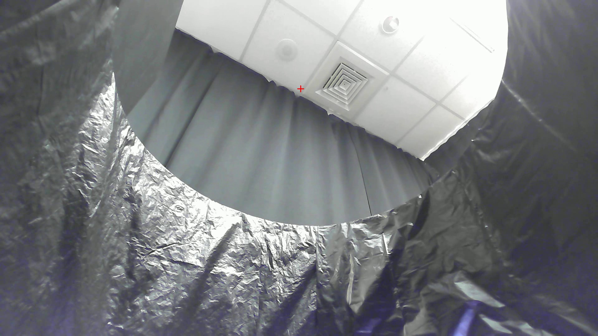
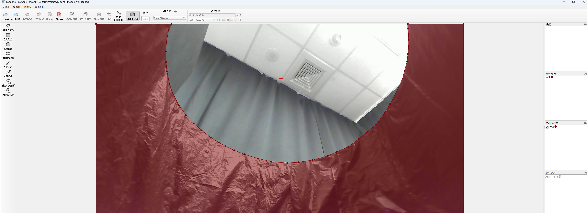

# 魔井專用-人體偵測模組

---

## 系統環境需求
### 1. 硬體需求
- Intel 第11代i7以上
- RAM 16GB以上
- (optional) Nvidia GPU 3060以上

---

### 2.軟體需求
- windows 11
- 安裝uv
```ps
powershell -ExecutionPolicy ByPass -c "irm https://astral.sh/uv/install.ps1 | iex“
```
---

### 3. 模組環境安裝
在Mojing資料夾中，開啟Terminal視窗後，執行
```ps
uv sync
```
安裝labelme標記工具
```
uv tool install --upgrade labelme
```
---

## 系統設定

### 1. 參數設定
打開mojing_openvino.py可設定

| 參數                   | 型別    | 說明                   |
|----------------------|-------|----------------------|
| `source`             | int   | Webcam Device ID。    |
| `mirror`             | bool  | 鏡像翻轉 (僅對 Webcam 有效)。 |
| `width`              | int   | 影像寬度設定               |
| `height`             | int   | 影像高度設定。              |
| `draw_skeleton`      | bool  | 是否繪製骨架。              |
| `keypoint_threshold` | float | 骨架節點信心門檻。            |
| `center_x`           | int   | 算角度用的圓心X座標。          |
| `center_y`           | int   | 算角度用的圓心Y座標。          |
| `mask_path`          | str   | 遮罩檔案路徑。            |

### 2. YOLO模型下載
```
uv run python pytorch2openvino.py
```

### 3. 環境遮罩製作
可以用windows作業系統內建的相機應用程式，擷取一張無人時的攝影機畫面，如下


啟動標記工具
```
uv tool run labelme
```

標記後如下


轉出標記的遮罩檔案
```
uv run python labelme2voc.py --input_file images/well_lab.json --noobject
```

替換遮罩檔案路徑

### 4. 設定井的圓心
利用上一步驟拍攝的井口圖像，用小畫家或其他看圖軟體，找到井的圓心X和Y座標位置
設定center_x和center_y